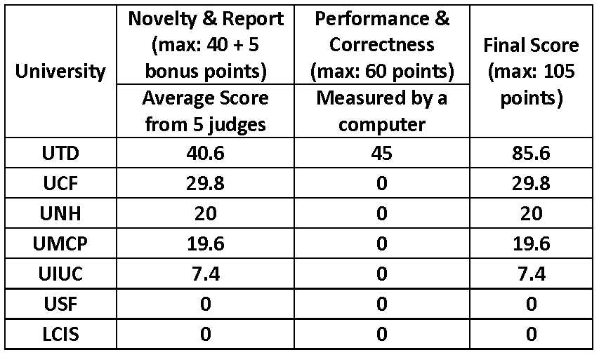

Finalists
=========

The following teams have qualified to the final round (in random order):

-   No Comment **University of Illinois at Urbana Champaign**: Peter Fischer, Hiroshi Fuji, Duyen Le (mentor:
    Masooda Bashir)

-   LCIS **Grenoble Institute of Technology**: Isabelle Boulay, Jeremy Dubeuf, Arash Nejat (mentor:
    David Hely)

-   SSL **University of Central Florida**: Orlando Arias, Jacob Wurm, Khoa Hoang (mentor: Yier Jin)

-   Wildcats **University of New Hampshire**: William Melanson, Chenghua She, Jaya Dofe (mentor:
    Qiaoyan Yu)

-   MESHsec **University of Maryland College Park**: Tanvir Arafin, Mingze Gao, Qian Wang (mentor: Gang Qu)

-   LOGICS **University of South Florida**: John Gangemi, Sebastian Otero (mentor: Swaroop Ghosh)

-   TRELA **University of Texas at Dallas**: Gaurav Rajavendra Reddy, Liwei Zhou, Mohammad-Mahdi
    Bidmeshki (mentors: Yiorgos Makris, Jeyavijayan Rajendran)

Final Results
=============
The final results of the ESC competition are as follows:
-	**1st place** (winners) - University of Texas at Dallas: **Team TRELA**
-	**2nd place** (runner-up) - University of Central Florida: **Team SSL**
-	**3rd place** - University of New Hampshire: **Team Wildcats**

The winners were determined according to the grading information presented in the [points distribution](esc2015_phase2.md#points-distribution) section. A team of 5 expert judges from the industry, assessed the finalists based on **Novelty** and **Report** criteria, while a computer program assessed the finalists based on **Correctness** and **Performance**. Novelty was graded up to a maximum of 25 points, considering how the MAC was attacked (e.g., use of length extension attack, brute-forcing, precomputation optimizations, fast modulo 524287 optimization using digit addition etc.), as well as how the encrypted votes were redistributed (e.g., N factorization with generic or probabilistic methods, accumulation of encrypted votes, use of Montgomery, encryption of plaintext votes, computation of modular inverses, use of extended Euclidean algorithm etc.). Report was graded to a maximum of 15 points (plus 5 bonus points) depending on the level of elaboration and analysis, the quality of the technical content, the overall presentation of the report, as well as the quality of the poster presentation and ability to explain. The 5 bonus points were distributed if performance experiments and comparisons were given, as well as theoretical analysis on vulnerability exploitation.

Regarding Correctness, the assessment was made by a computer program over 4 scenarios and the decision was binary (i.e., points were awarded only if the attack worked correctly using the FPGA), and no partial credit was given. Similarly, Performance was assessed by the computer, by measuring the time elapsed between the first legitimate frame observed by the FPGA and the last malicious frame generated by the FPGA to trigger a correct attack. If the attack was incorrect or no attack was generated by the FPGA, no performance points were awarded. Only one team was able to generate correct attacks for 3 scenarios using their FPGA design.

The following table presents the average grades on Novelty and Report from the 5 judges, as well as Correctness and Performance from the computer-based evaluation:

